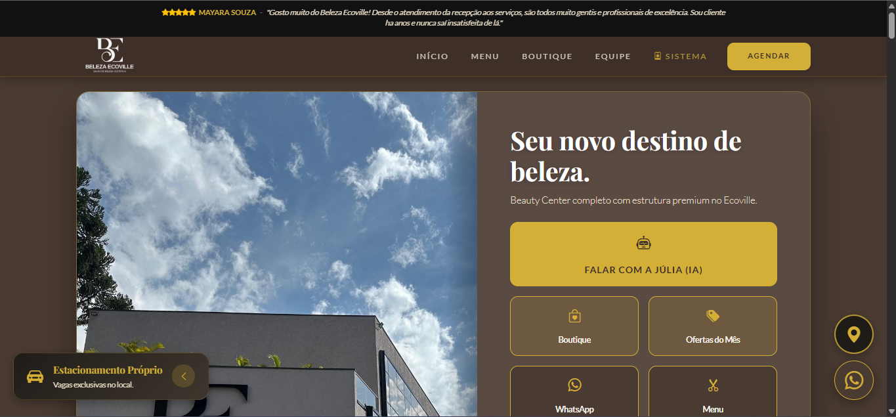
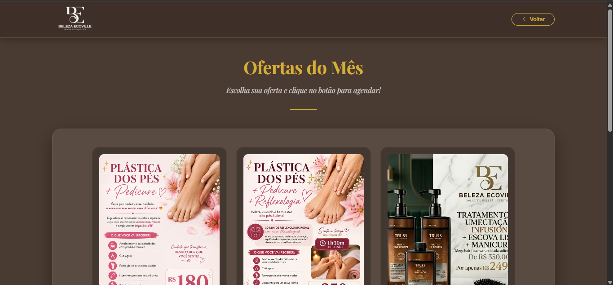
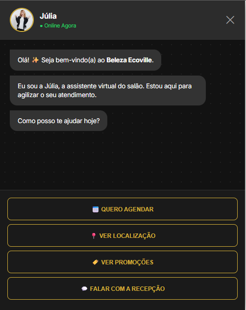
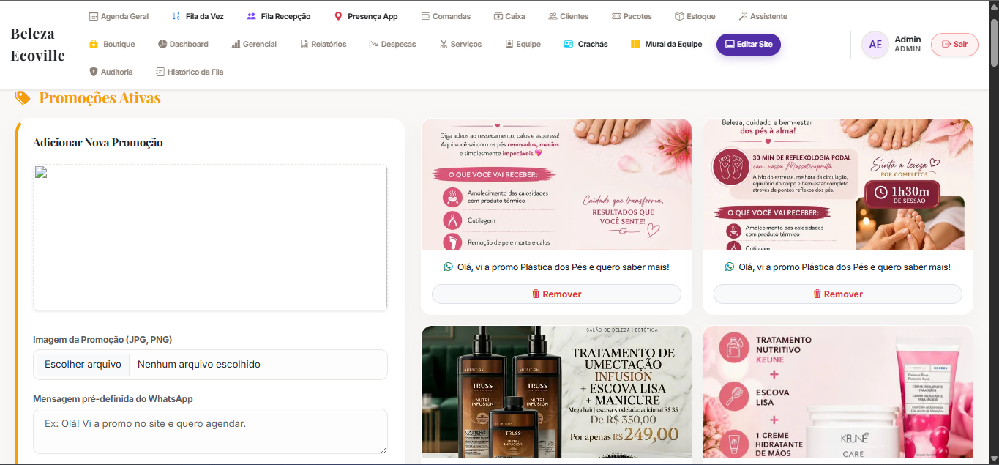

# Site Beleza Ecoville

Site institucional com páginas promocionais, chatbot interativo, área administrativa e gerenciamento de conteúdo — desenvolvido para um salão de beleza.


---

## Descrição

Aplicação web desenvolvida para atender às necessidades de presença digital de um salão de beleza. Combina um site institucional responsivo com um chatbot de agendamento, painel administrativo para gerenciar promoções e serviços, e áreas internas para equipe (recepção e manicure). Os dados são persistidos em arquivos JSON locais, sem banco de dados externo.

---

## Visão Geral

O sistema é organizado em Express 5 com renderização via EJS. Sessões protegem as áreas administrativas e de equipe. O upload de imagens de promoções é feito via Multer com validação de tipo e tamanho. O conteúdo dinâmico (serviços, promoções, atendimentos) é lido e gravado diretamente em arquivos JSON no servidor.

---

## Funcionalidades Principais

- **Site institucional** — Página inicial com apresentação do salão, serviços e informações de contato
- **Promoções** — Página dinâmica de promoções gerenciada pelo painel administrativo, com upload de imagens
- **Chatbot** — Atendimento automatizado com opções clicáveis de agendamento e dúvidas frequentes
- **Área administrativa** — Gestão de promoções, serviços e conteúdo do site com upload de imagens
- **Controle de serviços** — Cadastro e edição da tabela de serviços exibida no site
- **Área de recepção** — Registro e acompanhamento de atendimentos do dia
- **Área de manicure** — Painel interno específico para a profissional de manicure
- **Controle de esterilização** — Registro de esterilização de materiais com histórico

---

## Principais Telas / Views

| View | Rota | Descrição |
|---|---|---|
| `index.ejs` | `/` | Página inicial do site institucional |
| `promocoes.ejs` | `/promocoes` | Página pública de promoções |
| `chatbot.ejs` | `/chatbot` | Chatbot de atendimento com opções clicáveis |
| `login.ejs` | `/login` | Autenticação para áreas restritas |
| `admin.ejs` | `/admin` | Painel administrativo — promoções e serviços |
| `recepcao.ejs` | `/recepcao` | Painel interno da recepção |
| `manicure.ejs` | `/manicure` | Painel interno da manicure |
| `estoque.ejs` | `/estoque` | Controle de estoque e esterilização |

---

## Screenshots

As imagens abaixo apresentam algumas telas do projeto em uso, com dados sensíveis removidos ou ocultados para fins de portfólio.

### Home



### Promoções



### Chatbot



### Admin



---
---

## Estrutura do Projeto

```
site-beleza-ecoville/
├── app.js                   # Servidor principal — todas as rotas e lógica
├── .env.example             # Variáveis de ambiente (modelo)
├── models/
│   └── MenuSite.js          # Model para itens de menu dinâmico
├── data/                    # Dados persistidos em JSON (não versionados)
│   ├── promocoes.json       # Promoções ativas
│   ├── servicos.json        # Tabela de serviços
│   ├── usuarios.json        # Usuários internos
│   ├── atendimentos.json    # Registro de atendimentos
│   └── esterilizacao.json   # Histórico de esterilização
├── views/
│   ├── index.ejs            # Home
│   ├── promocoes.ejs        # Página de promoções
│   ├── chatbot.ejs          # Chatbot
│   ├── admin.ejs            # Painel administrativo
│   ├── login.ejs            # Login
│   ├── recepcao.ejs         # Área da recepção
│   ├── manicure.ejs         # Área da manicure
│   └── estoque.ejs          # Controle de estoque
└── public/
    ├── images/              # Imagens do site (não versionadas — dados reais)
    ├── data/                # Dados públicos em JSON
    └── manifest.json        # PWA manifest
```

---

## Como Executar Localmente

```bash
# 1. Clone o repositório
git clone <url-do-repositorio>
cd site-beleza-ecoville

# 2. Instale as dependências
npm install

# 3. Configure as variáveis de ambiente
cp .env.example .env
# Edite .env com seus valores

# 4. Inicie o servidor
node app.js
```

Acesse em: `http://localhost:3000`

> **Requisito mínimo:** Node.js 18+  
> Os arquivos em `data/` são criados automaticamente na primeira execução caso não existam.

---

## Segurança e Dados Sensíveis

Este repositório **não contém e não deve conter**:

- Arquivo `.env` com senhas reais
- Arquivos em `data/` com dados reais de clientes ou atendimentos
- Imagens reais de promoções ou do salão (pasta `public/images/`)
- Dados de usuários internos

Use `.env.example` como referência. Os arquivos JSON em `data/` são gerados automaticamente com estrutura vazia na primeira execução.

---

## Status

`Em produção` — Projeto desenvolvido para uso real em salão de beleza, apresentado como portfólio profissional.

---

## Autor

Desenvolvido por **Wanderley Muzati Buim Neto**

- GitHub: [github.com/wbuim](https://github.com/wbuim)
- LinkedIn: [linkedin.com/in/neto-buim-0a1698297](https://linkedin.com/in/neto-buim-0a1698297)
